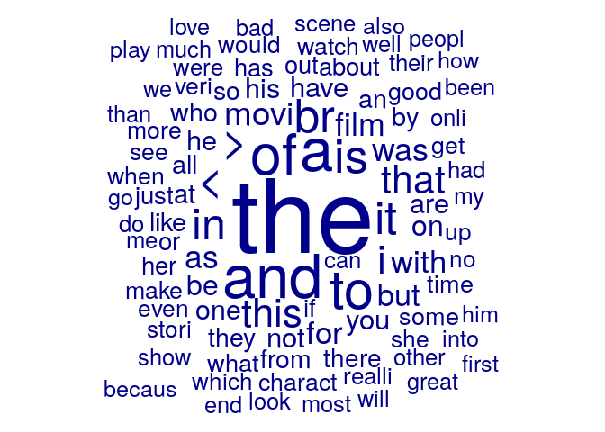
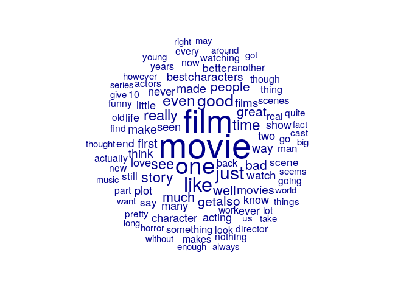
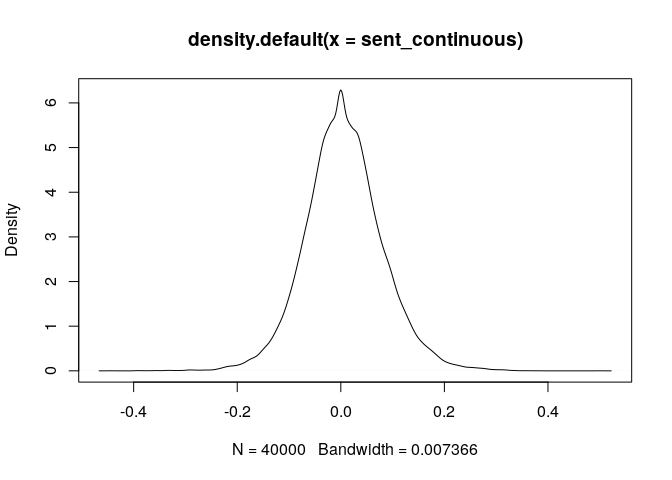
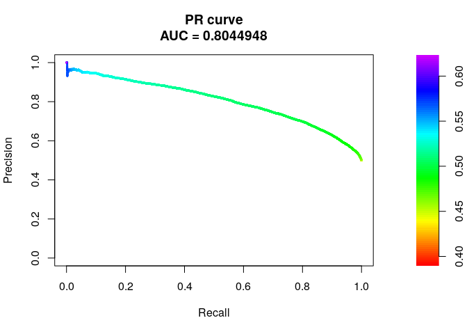
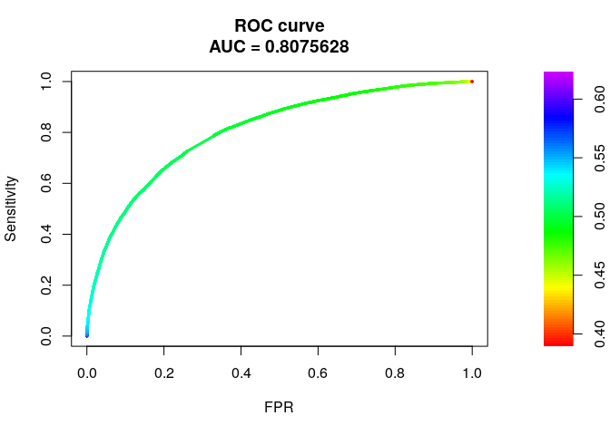

Lecture 4 codes
================

## Preprocessing text data with quanteda

Let us check out an dataset containing [IMDB Movie Review
Dataset](https://www.kaggle.com/columbine/imdb-dataset-sentiment-analysis-in-csv-format).
Some codes are borrowed from [Pablo
Barbera](http://pablobarbera.com/text-analysis-vienna/code.html).

Before we can do any type of automated text analysis, we will need to go
through “preprocessing” steps. We’ll use the `quanteda` package
[quanteda](https://github.com/kbenoit/quanteda) here. The manual is
[here](https://cran.r-project.org/web/packages/quanteda/quanteda.pdf).
The quick introduction is [here](https://quanteda.io/).

The basic unit of work for the `quanteda` package is called a `corpus`,
which represents a collection of text documents with some associated
metadata. Documents are the subunits of a corpus. You can use `summary`
to get some information about your corpus. In the terminology of
`quanteda`, `type` means *unique* words. `Token` mean any word.

``` r
library(quanteda)
library(data.table) # this package help you to read large files quicker
reviews <- fread("train.csv") # fread() is a function in data.table
twcorpus <- corpus(reviews$text)
summary(twcorpus, n=10)
```

    ## Corpus consisting of 40000 documents, showing 10 documents:
    ## 
    ##    Text Types Tokens Sentences
    ##   text1   122    176        15
    ##   text2   183    387        14
    ##   text3   130    200         9
    ##   text4    55     76         5
    ##   text5   133    224         7
    ##   text6    85    120         7
    ##   text7   154    291        10
    ##   text8   175    336        13
    ##   text9   130    213         7
    ##  text10   169    337         6

A very useful feature of corpus objects is *keywords in context*, which
returns all the appearances of a word (or combination of words) in its
immediate context.

``` r
kwic(twcorpus, "like", window=5)[1:5,]
```

    ##                                                    
    ##  [text2, 203]         of a few characters, | like |
    ##  [text2, 237]            weak, as its more | like |
    ##  [text2, 327] liked schooby-doo, you might | like |
    ##   [text3, 16]         time in the past was | like |
    ##  [text3, 156]           in a bar who looks | like |
    ##                                    
    ##  the voice of Sweet)               
    ##  three episodes of Schooby-Doo than
    ##  this movie. If you                
    ##  feel the need to try              
    ##  Diane Lane, I'm running

We can then convert a corpus into a document-feature matrix using the
`dfm`
    function.

``` r
doc.term <- dfm(twcorpus, verbose=TRUE)
```

    ## Creating a dfm from a corpus input...

    ##  ...lowercasing

    ##  ...found 40,000 documents, 133,410 features

    ##  ...complete, elapsed time: 7.94 seconds.

    ## Finished constructing a 40,000 x 133,410 sparse dfm.

``` r
doc.term
```

    ## Document-feature matrix of: 40,000 documents, 133,410 features (99.9% sparse).
    ##        features
    ## docs     i grew up ( b  . 1965 ) watching and
    ##   text1  3    1  1 1 1 17    1 1        1   3
    ##   text2 10    0  0 2 0 16    0 2        0   7
    ##   text3  1    0  0 0 0  6    0 0        1   5
    ##   text4  3    0  0 0 0  5    0 0        0   3
    ##   text5  3    0  1 2 0 10    0 2        0   9
    ##   text6  1    0  0 0 0  6    0 0        0   0
    ## [ reached max_ndoc ... 39,994 more documents, reached max_nfeat ... 133,400 more features ]

Similar to a normal matrix, the dimension of document-term matrix in
`quanteda` can be obtained by

``` r
 dim(doc.term)
```

    ## [1]  40000 133410

To see how frequent a word appears, just take som the column. For
instance, to get how many times the word `school`
appears:

``` r
which_column_num_is_school <- which(colnames(doc.term) == "school") ## it's the 8-th column
colSums(doc.term[,which_column_num_is_school])
```

    ## school 
    ##   2635

You can subset the document-term matrix using the following
    way:

``` r
doc.term[1:5, 1:10]
```

    ## Document-feature matrix of: 5 documents, 10 features (44.0% sparse).
    ##        features
    ## docs     i grew up ( b  . 1965 ) watching and
    ##   text1  3    1  1 1 1 17    1 1        1   3
    ##   text2 10    0  0 2 0 16    0 2        0   7
    ##   text3  1    0  0 0 0  6    0 0        1   5
    ##   text4  3    0  0 0 0  5    0 0        0   3
    ##   text5  3    0  1 2 0 10    0 2        0   9

Before running any function, you are *strongly recommended* to read its
help function first. `dfm` has many useful options (check out `?dfm` or
`help(dfm)` for more information). Let’s actually use it to stem the
text, extract n-grams, remove punctuation, keep Twitter
features…

``` r
doc.term <- dfm(twcorpus, tolower=TRUE, stem=TRUE, remove_punct = TRUE, remove_url=TRUE, ngrams=1:3, verbose=TRUE)
```

    ## Creating a dfm from a corpus input...

    ##  ...lowercasing

    ## Warning: ngrams argument is not used.

    ##  ...found 40,000 documents, 133,237 features

    ##  ...stemming types (English)

    ##  ...complete, elapsed time: 9.01 seconds.

    ## Finished constructing a 40,000 x 94,718 sparse dfm.

``` r
doc.term
```

    ## Document-feature matrix of: 40,000 documents, 94,718 features (99.9% sparse).
    ##        features
    ## docs     i grew up b 1965 watch and love the thunderbird
    ##   text1  3    1  1 1    1     2   3    2   7           3
    ##   text2 10    0  0 0    0     0   7    0  20           0
    ##   text3  1    0  0 0    0     1   5    0  10           0
    ##   text4  3    0  0 0    0     0   3    0   7           0
    ##   text5  3    0  1 0    0     1   9    0  13           0
    ##   text6  1    0  0 0    0     0   0    0   4           0
    ## [ reached max_ndoc ... 39,994 more documents, reached max_nfeat ... 94,708 more features ]

Note that here we use ngrams – this will extract all combinations of
one, two, and three words (e.g. it will consider both “human”, “rights”,
and “human rights” as tokens in the matrix).

In `Quanteda`, stemming relies on the `SnowballC` package’s
implementation of the Porter stemmer:

``` r
example <- tolower(reviews$text[1]) 
print (reviews$text[1])
```

    ## [1] "I grew up (b. 1965) watching and loving the Thunderbirds. All my mates at school watched. We played \"\"Thunderbirds\"\" before school, during lunch and after school. We all wanted to be Virgil or Scott. No one wanted to be Alan. Counting down from 5 became an art form. I took my children to see the movie hoping they would get a glimpse of what I loved as a child. How bitterly disappointing. The only high point was the snappy theme tune. Not that it could compare with the original score of the Thunderbirds. Thankfully early Saturday mornings one television channel still plays reruns of the series Gerry Anderson and his wife created. Jonatha Frakes should hand in his directors chair, his version was completely hopeless. A waste of film. Utter rubbish. A CGI remake may be acceptable but replacing marionettes with Homo sapiens subsp. sapiens was a huge error of judgment."

``` r
print ("-----------Tokens")
```

    ## [1] "-----------Tokens"

``` r
token1 <- tokens(example) #token of the first document
print (token1) # only the first 10 was printed
```

    ## Tokens consisting of 1 document.
    ## text1 :
    ##  [1] "i"        "grew"     "up"       "("        "b"        "."       
    ##  [7] "1965"     ")"        "watching" "and"      "loving"   "the"     
    ## [ ... and 164 more ]

What if we want to print more? The way to do this is to go to the
reference manual, and search `print`. You will see additional options
and find that specifying `max_ntoken` allow you to print more.

``` r
print (token1, max_ntoken = 1000)
```

    ## Tokens consisting of 1 document.
    ## text1 :
    ##   [1] "i"             "grew"          "up"            "("            
    ##   [5] "b"             "."             "1965"          ")"            
    ##   [9] "watching"      "and"           "loving"        "the"          
    ##  [13] "thunderbirds"  "."             "all"           "my"           
    ##  [17] "mates"         "at"            "school"        "watched"      
    ##  [21] "."             "we"            "played"        "\""           
    ##  [25] "\""            "thunderbirds"  "\""            "\""           
    ##  [29] "before"        "school"        ","             "during"       
    ##  [33] "lunch"         "and"           "after"         "school"       
    ##  [37] "."             "we"            "all"           "wanted"       
    ##  [41] "to"            "be"            "virgil"        "or"           
    ##  [45] "scott"         "."             "no"            "one"          
    ##  [49] "wanted"        "to"            "be"            "alan"         
    ##  [53] "."             "counting"      "down"          "from"         
    ##  [57] "5"             "became"        "an"            "art"          
    ##  [61] "form"          "."             "i"             "took"         
    ##  [65] "my"            "children"      "to"            "see"          
    ##  [69] "the"           "movie"         "hoping"        "they"         
    ##  [73] "would"         "get"           "a"             "glimpse"      
    ##  [77] "of"            "what"          "i"             "loved"        
    ##  [81] "as"            "a"             "child"         "."            
    ##  [85] "how"           "bitterly"      "disappointing" "."            
    ##  [89] "the"           "only"          "high"          "point"        
    ##  [93] "was"           "the"           "snappy"        "theme"        
    ##  [97] "tune"          "."             "not"           "that"         
    ## [101] "it"            "could"         "compare"       "with"         
    ## [105] "the"           "original"      "score"         "of"           
    ## [109] "the"           "thunderbirds"  "."             "thankfully"   
    ## [113] "early"         "saturday"      "mornings"      "one"          
    ## [117] "television"    "channel"       "still"         "plays"        
    ## [121] "reruns"        "of"            "the"           "series"       
    ## [125] "gerry"         "anderson"      "and"           "his"          
    ## [129] "wife"          "created"       "."             "jonatha"      
    ## [133] "frakes"        "should"        "hand"          "in"           
    ## [137] "his"           "directors"     "chair"         ","            
    ## [141] "his"           "version"       "was"           "completely"   
    ## [145] "hopeless"      "."             "a"             "waste"        
    ## [149] "of"            "film"          "."             "utter"        
    ## [153] "rubbish"       "."             "a"             "cgi"          
    ## [157] "remake"        "may"           "be"            "acceptable"   
    ## [161] "but"           "replacing"     "marionettes"   "with"         
    ## [165] "homo"          "sapiens"       "subsp"         "."            
    ## [169] "sapiens"       "was"           "a"             "huge"         
    ## [173] "error"         "of"            "judgment"      "."

We check results after stemming

``` r
print (token1)
```

    ## Tokens consisting of 1 document.
    ## text1 :
    ##  [1] "i"        "grew"     "up"       "("        "b"        "."       
    ##  [7] "1965"     ")"        "watching" "and"      "loving"   "the"     
    ## [ ... and 164 more ]

``` r
print ("-----------Tokens after stemming")
```

    ## [1] "-----------Tokens after stemming"

``` r
tokens_wordstem(token1)
```

    ## Tokens consisting of 1 document.
    ## text1 :
    ##  [1] "i"     "grew"  "up"    "("     "b"     "."     "1965"  ")"     "watch"
    ## [10] "and"   "love"  "the"  
    ## [ ... and 164 more ]

We can also see the results of n-grams of the first document. I use up
to 3-gram in the below code.

``` r
tokens_ngrams(token1, 1:3)
```

    ## Tokens consisting of 1 document.
    ## text1 :
    ##  [1] "i"        "grew"     "up"       "("        "b"        "."       
    ##  [7] "1965"     ")"        "watching" "and"      "loving"   "the"     
    ## [ ... and 513 more ]

In a large corpus like this, many features often only appear in one or
two documents. In some case it’s a good idea to remove those features,
to speed up the analysis or because they’re not relevant. We can `trim`
the
    dfm:

``` r
doc.term <- dfm_trim(doc.term, min_docfreq=10, verbose=TRUE)
```

    ## Removing features occurring:

    ##   - in fewer than 10 documents: 77,993

    ##   Total features removed: 77,993 (82.3%).

``` r
doc.term
```

    ## Document-feature matrix of: 40,000 documents, 16,725 features (99.2% sparse).
    ##        features
    ## docs     i grew up b 1965 watch and love the thunderbird
    ##   text1  3    1  1 1    1     2   3    2   7           3
    ##   text2 10    0  0 0    0     0   7    0  20           0
    ##   text3  1    0  0 0    0     1   5    0  10           0
    ##   text4  3    0  0 0    0     0   3    0   7           0
    ##   text5  3    0  1 0    0     1   9    0  13           0
    ##   text6  1    0  0 0    0     0   0    0   4           0
    ## [ reached max_ndoc ... 39,994 more documents, reached max_nfeat ... 16,715 more features ]

We can also weight the matrix by idf values.

``` r
tfidf <- dfm_tfidf(doc.term)
```

It’s often a good idea to take a look at the most frequent words in your
corpus. We can also see the list using
    `topFeatures`

``` r
topfeatures(doc.term, 25)
```

    ##    the    and      a     of     to     is     it      >      <     br     in 
    ## 532574 259256 257588 230969 213962 168883 164707 161710 161576 161465 148096 
    ##      i   this   that   movi    was   film     as    for   with    but     on 
    ## 123122 120593 115508  81553  76467  75540  73404  69709  69672  66743  53739 
    ##     be    you    not 
    ##  53096  48616  48342

You can also visualize the most frequent
words.

``` r
textplot_wordcloud(doc.term, rotation=0, min_size=2, max_size=10, max_words=100)
```

    ## Warning in wordcloud(x, min_size, max_size, min_count, max_words, color, : think
    ## could not be fit on page. It will not be plotted.

<!-- -->

As you can see, there are a bunch of stopwords. Beside the standard
stopwords, we also add several things related to web (“http”) for
example. (this step does not limit by word frequencies as we did
earlier).

``` r
doc.term <- dfm(twcorpus, remove_punct = TRUE, remove=c(
  stopwords("english"), "the", "t.co", "https", "rt", "amp", "http", "t.c", "can", "u", "<", ">", "br"), remove_url=TRUE, verbose=TRUE)
```

    ## Creating a dfm from a corpus input...

    ##  ...lowercasing

    ##  ...found 40,000 documents, 133,237 features

    ##  ...removed 184 features
    ##  ...complete, elapsed time: 8.19 seconds.
    ## Finished constructing a 40,000 x 133,054 sparse dfm.

``` r
textplot_wordcloud(doc.term, rotation=0, min_size=1, max_size=5, max_words=100)
```

<!-- -->

## Dictionary methods

Let’s try sentiment analysis with dictionary method. First, downlaod [Hu
and Liu’s opinion lexicon’s
here](http://www.cs.uic.edu/~liub/FBS/opinion-lexicon-English.rar). The
link is also mentioned in class tutorial.

``` r
pos.words <- read.csv("opinion-lexicon-English/positive-words.txt",
                 stringsAsFactors = FALSE, header = FALSE)$V1
head(pos.words)
```

    ## [1] "a+"         "abound"     "abounds"    "abundance"  "abundant"  
    ## [6] "accessable"

``` r
neg.words <- read.csv("opinion-lexicon-English/negative-words.txt",
                 stringsAsFactors = FALSE, header = FALSE)$V1
head(neg.words)
```

    ## [1] "2-faced"    "2-faces"    "abnormal"   "abolish"    "abominable"
    ## [6] "abominably"

Next, construct a dictionary object. In this dictionry, there are two
keys (“positive” and “negative”), each maps to a list as its values.
(think what Python’s dict means; it’s similar).

``` r
mydict <- dictionary(list(positive = pos.words,
                          negative = neg.words))
```

And now we apply it to the corpus in order to count the number of words
that appear in each category. (also remember to do other preprocessing
steps, or using the object that’s after
preprocessing.

``` r
# sent <- dfm(twcorpus, dictionary = mydict, remove_punct = TRUE, remove=c(
  # stopwords("english"), "the", "t.co", "https", "rt", "amp", "http", "t.c", "can", "u", "<", ">", "br"),remove_url=TRUE, verbose=TRUE)
sent <- dfm(doc.term, dictionary = mydict)

sent
```

    ## Document-feature matrix of: 40,000 documents, 2 features (1.88% sparse).
    ##        features
    ## docs    positive negative
    ##   text1        3        6
    ##   text2       16        9
    ##   text3        3        9
    ##   text4        1        5
    ##   text5        7        5
    ##   text6        5        6
    ## [ reached max_ndoc ... 39,994 more documents ]

We can then extract the score and add it to the data frame as a new
variable. Because the outcome is binary, we coerce the continuous
sentiment score into a binary one, if the review has more positive than
negative
words.

``` r
reviews$score <- ifelse(as.numeric(sent[,1]) > as.numeric(sent[,2]), 1, 0)
```

## Evaluation

Compare our prediction with that on the true labels. Are our predictions
correct?

Before starting, you should always looking at the distribution in
outcomes. In this case, it’s balanced. So a random guess will yield an
accuracy of 0.5. This is the baseline we want to beat.

Also, here, we are actually not *learning* anything from the training
data. The dictionary is took from somewhere else and it’s not related to
our training data. So here, we can calculate performances on the
training data. But for supervised machine learning, it’s not recommended
to calculate performances on training data; we will still calculate
performances on test data.

``` r
table(reviews$label)
```

    ## 
    ##     0     1 
    ## 20019 19981

First, let us calculate the confusion matrix

``` r
table(actual = reviews$label, predicted = reviews$score)
```

    ##       predicted
    ## actual     0     1
    ##      0 14825  5194
    ##      1  5480 14501

For positive sentiment:

  - accuracy:
    \(\frac{14510 + 14826}{14826+14826+5471+5193} = 0.7276516\)
  - precision: \(\frac{14510}{14826+5193} = 0.7248114\)
  - recall: \(\frac{14510}{14826+5471} = 0.714884\)

Not bad\!

We can also literally code the math formula in the lecture slides (also
in Grimmer and Stewart 2013), which will produce a continuous score

\[t_i  = \frac{1}{N_i} \sum_{m=1}^M s_m W_{im}\]

``` r
numerator <- as.numeric(sent[,1]) + -1 * as.numeric(sent[,2])
denominator <- ntoken(doc.term) # or use rowSums(); it's the same
sent_continuous <- numerator/denominator
plot(density(sent_continuous))
```

<!-- -->

To do percision-recall curve or ROC curve, we need to transform this
continuous variable into a probability scale (within 0 to 1). We do this
by using performing a logistic transformation on the sent\_continuous,
and

``` r
sent_prob = plogis(sent_continuous) # probability of being 1 (positive)
reviews$sent_prob = sent_prob
```

We plot the precision-recall positive class, using `PRROC` package. Read
the package’s manual and you will find it allows two parameters - a list
of predicted probabilities for actual positive data points - a list of
predicted probabilities for actual negative data points

``` r
library(PRROC)

reviews.positive <- reviews[reviews$label == 1,]
reviews.negative <- reviews[reviews$label == 0,]
pr <- pr.curve(reviews.positive$sent_prob, reviews.negative$sent_prob, curve = TRUE )
plot(pr)
```

<!-- -->

And the same thing for ROC
curve

``` r
roc <- roc.curve(reviews.positive$sent_prob, reviews.negative$sent_prob, curve = TRUE )
plot(roc)
```

<!-- -->

In next lectures we will use supervised machine learning algorithms, to
see if we can improve this performance (on the test data, though\!).
